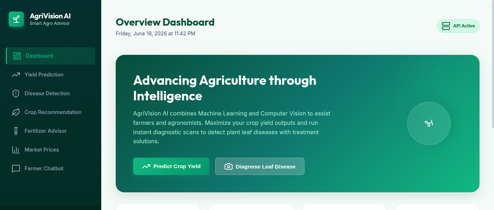
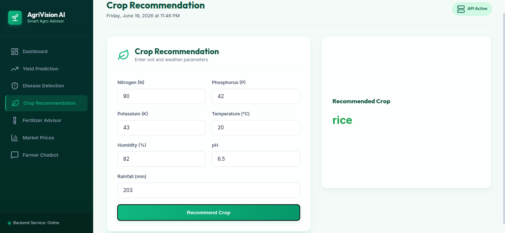
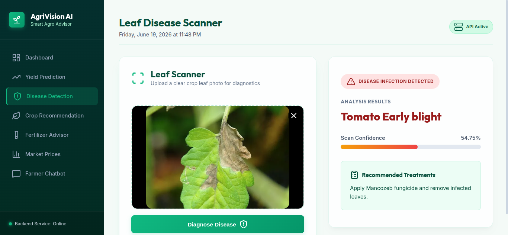
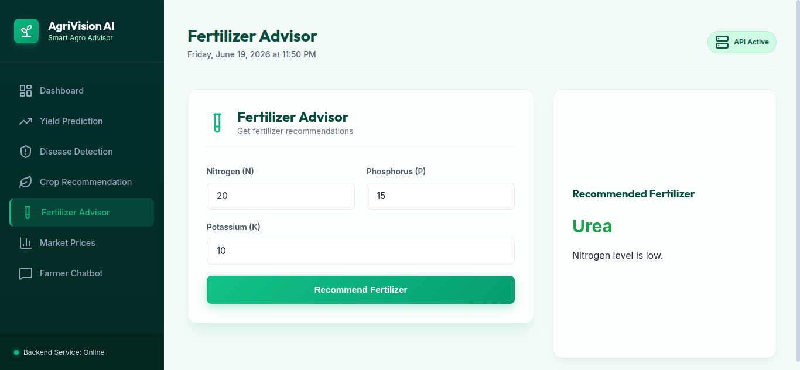
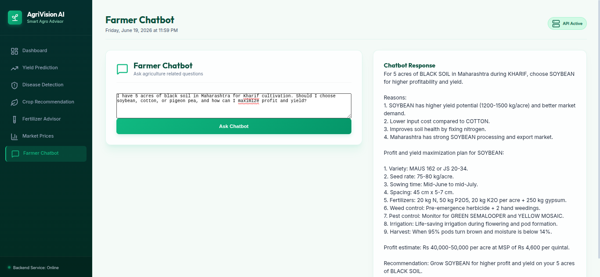

# 🌱 AgriVision AI

### AI-Powered Smart Agriculture Advisor using Machine Learning, Deep Learning & Generative AI

<p align="center">
  
  
  
  
  
</p>

> **Perfect for students, researchers, and farmers!** This project combines Machine Learning, Deep Learning, and Mistral AI to provide intelligent agricultural recommendations and decision support.

---

# 📋 Table of Contents

1. What is this project?
2. What does it do?
3. Key Features
4. Project Folder Structure
5. File-by-File Explanation
6. How the System Works
7. Machine Learning Models Used
8. Deep Learning Model Used
9. AI Farmer Chatbot
10. Screenshots
11. Installation Guide
12. How to Run the Project
13. Model Performance
14. Important Notes
15. Common Questions
16. Future Enhancements
17. Tech Stack Summary
18. Author

---

# 🌾 What is this Project?

Agriculture is one of the most important sectors worldwide, but farmers often face challenges related to:

* Crop Selection
* Plant Diseases
* Fertilizer Management
* Yield Estimation
* Market Price Analysis
* Weather Conditions

AgriVision AI is an AI-powered agricultural assistant that helps farmers make informed decisions using data-driven recommendations.

The platform integrates:

* Machine Learning
* Deep Learning
* Generative AI
* Agricultural Analytics

into a single intelligent farming solution.

---

# ✨ What Does it Do?

| Feature                  | Description                                                       |
| ------------------------ | ----------------------------------------------------------------- |
| 🌾 Crop Recommendation   | Suggests the best crop based on soil and environmental conditions |
| 🍃 Disease Detection     | Detects crop diseases from leaf images                            |
| 📈 Yield Prediction      | Predicts expected crop yield                                      |
| 🧪 Fertilizer Advisor    | Recommends suitable fertilizers                                   |
| 🌦 Weather Module        | Provides weather-based farming insights                           |
| 💹 Market Price Analysis | Helps farmers understand market trends                            |
| 🤖 AI Farmer Chatbot     | Conversational agricultural assistant powered by Mistral AI       |

---

# 🚀 Key Features

### 🌾 Crop Recommendation

Uses agricultural parameters such as:

* Nitrogen
* Phosphorus
* Potassium
* Temperature
* Humidity
* Rainfall

to recommend suitable crops.

---

### 🍃 Plant Disease Detection

Farmers can upload crop leaf images.

The system:

* Identifies diseases
* Provides confidence scores
* Suggests treatments

---

### 📈 Yield Prediction

Predicts agricultural yield using:

* Historical data
* Crop information
* Environmental factors

---

### 🧪 Fertilizer Advisor

Provides fertilizer recommendations based on:

* Soil nutrients
* Crop requirements
* Environmental conditions

---

### 🤖 AI Farmer Chatbot

Powered by Mistral AI.

Farmers can ask questions like:

> I have 5 acres of black soil in Maharashtra for Kharif cultivation. Should I choose soybean, cotton, or pigeon pea, and how can I maximize profit and yield?

and receive intelligent agricultural guidance.

---

# 📁 Project Folder Structure

```text
AgriVision-AI
│
├── backend
│   ├── app.py
│   ├── chatbot.py
│   ├── crop_recommendation_predictor.py
│   ├── disease_predictor.py
│   ├── fertilizer_advisor.py
│   ├── market_price.py
│   ├── weather_predictor.py
│   └── yield_predictor.py
│
├── frontend
│   ├── index.html
│   ├── script.js
│   └── style.css
│
├── models
│   ├── area_encoder.pkl
│   ├── crop_recommendation_model.pkl
│   └── item_encoder.pkl
│
├── notebooks
│   ├── crop_recommendation.ipynb
│   ├── disease_detection.ipynb
│   ├── mobilenetv2_model.ipynb
│   └── yield_prediction.ipynb
│
├── screenshots
│   ├── dashboard.png
│   ├── crop_recommendation.png
│   ├── disease_detection.png
│   ├── chatbot.png
│   └── fertilizer_advisor.png
│
├── requirements.txt
├── .gitignore
└── README.md
```

---

# 📝 File-by-File Explanation

## backend/app.py

Main Flask application.

Responsibilities:

* Receives requests from frontend
* Processes user inputs
* Calls AI modules
* Returns predictions

---

## chatbot.py

Mistral AI integration.

Handles:

* User questions
* Prompt processing
* Response generation

---

## crop_recommendation_predictor.py

Predicts suitable crops based on soil and environmental conditions.

---

## disease_predictor.py

Loads the trained disease detection model and predicts crop diseases from uploaded images.

---

## fertilizer_advisor.py

Provides fertilizer recommendations using nutrient values and crop requirements.

---

## market_price.py

Provides crop market insights.

---

## weather_predictor.py

Weather-related agricultural guidance.

---

## yield_predictor.py

Predicts crop yield using trained machine learning models.

---

# 🔄 How the System Works

```text
Farmer Input
      │
      ▼
Frontend Interface
      │
      ▼
Flask Backend
      │
      ├── Crop Recommendation
      ├── Disease Detection
      ├── Yield Prediction
      ├── Fertilizer Advisor
      ├── Weather Module
      ├── Market Analysis
      └── Mistral AI Chatbot
      │
      ▼
Recommendations & Insights
```

---

# 🤖 Machine Learning Models Used

| Module              | Model                   |
| ------------------- | ----------------------- |
| Crop Recommendation | ML Classifier           |
| Yield Prediction    | Random Forest Regressor |
| Fertilizer Advisor  | Rule-Based Logic        |

---

# 🍃 Deep Learning Model Used

## MobileNetV2

Used for:

* Plant Disease Detection

Benefits:

* Lightweight
* Fast Inference
* High Accuracy

### Results

* Validation Accuracy: **87.5%**
* Total Classes: **15**

---

# 💬 AI Farmer Chatbot

Powered by Mistral AI.

Capabilities:

* Crop Guidance
* Fertilizer Suggestions
* Productivity Improvement Tips
* Kharif/Rabi Season Recommendations
* Disease Information
* Agricultural Best Practices

---

# 📸 Screenshots

## Dashboard



## Crop Recommendation



## Disease Detection



## Fertilizer Advisor



## AI Farmer Chatbot



---

# ⚙️ Installation Guide

## Clone Repository

```bash
git clone https://github.com/TanushriK2005/AgriVision-AI.git
```

```bash
cd AgriVision-AI
```

## Create Virtual Environment

Linux:

```bash
python -m venv venv
source venv/bin/activate
```

Windows:

```bash
python -m venv venv
venv\Scripts\activate
```

## Install Dependencies

```bash
pip install -r requirements.txt
```

---

# 🚀 How to Run the Project

Start Backend:

```bash
python backend/app.py
```

Open:

```text
http://localhost:5000
```

---

# 📊 Model Performance

## Disease Detection

* Model: MobileNetV2
* Validation Accuracy: 87.5%

## Yield Prediction

* Model: Random Forest Regressor
* R² Score: 0.9833
* MAE: 4221.72
* RMSE: 10999.90

---

# ⚠️ Important Notes

## Missing Model File

The following file is not uploaded due to GitHub file size limitations:

```text
yield_prediction_model.pkl
```

The training notebook is included:

```text
notebooks/yield_prediction.ipynb
```

Users can retrain the model using the notebook.

---

# ❓ Common Questions

### Why is the Yield Prediction model missing?

GitHub restricts large file uploads. The training notebook is provided instead.

### Can I retrain the models?

Yes. Training notebooks are available inside the notebooks directory.

### Which AI model powers the chatbot?

Mistral AI.

---

# 🔮 Future Enhancements

* Mobile Application
* Voice-Based Farmer Assistant
* Multi-Language Support
* Satellite Image Analysis
* Smart Irrigation Recommendation
* Pest Detection Module
* Explainable AI Dashboard

---

# 🛠 Tech Stack Summary

| Technology   | Purpose             |
| ------------ | ------------------- |
| Python       | Backend Development |
| Flask        | API Backend         |
| HTML/CSS/JS  | Frontend            |
| Scikit-Learn | Machine Learning    |
| TensorFlow   | Deep Learning       |
| MobileNetV2  | Disease Detection   |
| Mistral AI   | Conversational AI   |
| GitHub       | Version Control     |

---

# 👩‍💻 Author

### Tanushri Kalaskar

B.Tech Information Technology

AI & Machine Learning Enthusiast

GitHub: https://github.com/TanushriK2005

---

# ⭐ Support

If you found this project useful:

⭐ Star the repository

🍴 Fork the repository

📢 Share it with others

---

### 🌱 Empowering Farmers Through Artificial Intelligence 🌱

